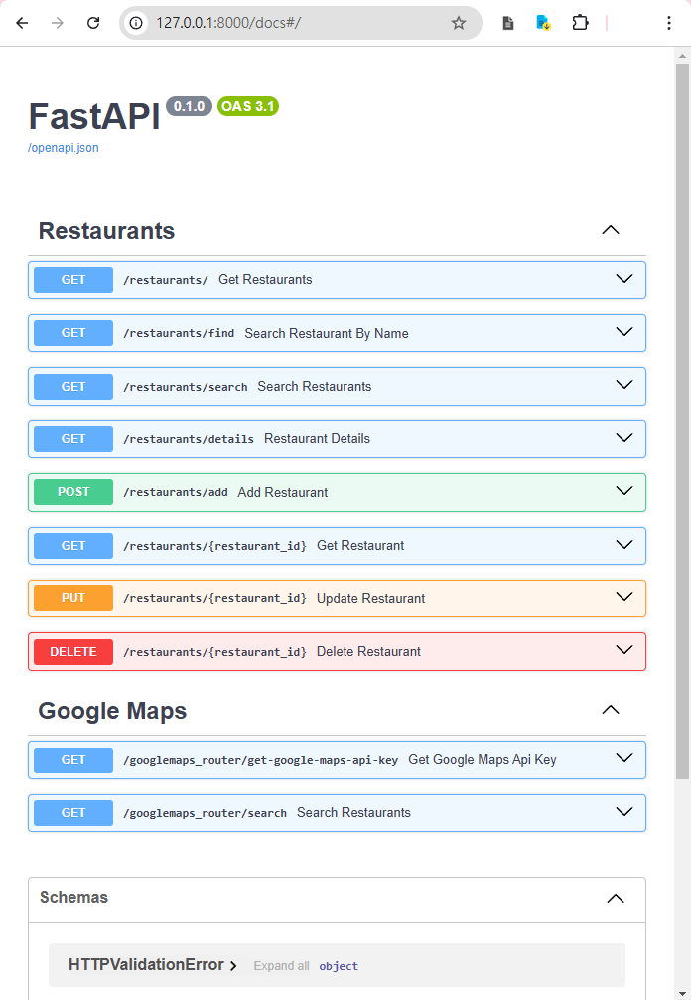
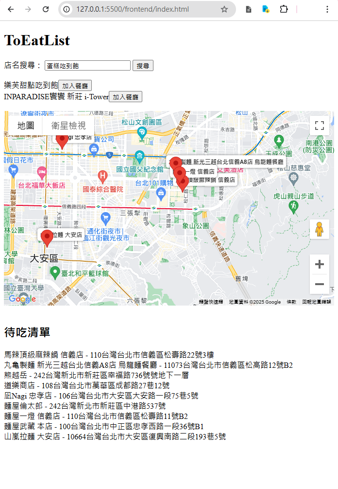

# ToEat List

美食待吃清單:
用ToDoList的形式，來記錄每一間可能榮登你心目中的美食殿堂的餐廳。

### 目錄
- [ToEat List](#toeat-list)
    - [目錄](#目錄)
  - [後端API說明](#後端api說明)
      - [遵守Restful api形式](#遵守restful-api形式)
      - [暫時是盡可能以MVC概念來開發](#暫時是盡可能以mvc概念來開發)
      - [以不同服務的範疇(Domain)來分類](#以不同服務的範疇domain來分類)
    - [簡易效果顯示(前端)](#簡易效果顯示前端)
  - [API功能說明](#api功能說明)
    - [Restaurants 相關功能](#restaurants-相關功能)
    - [Google Maps 相關功能](#google-maps-相關功能)
  - [Installation:](#installation)
  - [簡易效果顯示(前端)](#簡易效果顯示前端-1)
  

## 後端API說明



此Repo盡可能的符合以下概念

#### 遵守Restful api形式 
- [x] 已實作必要的CRUD們

#### 暫時是盡可能以MVC概念來開發 
-  [x] Model: ./models
- [ ] View: frontend資料夾下的基本展示 (待完善)
-  [x] Controller: main.py

#### 以不同服務的範疇(Domain)來分類
- [x] routers: API們
   - [x] restaurant: 餐廳相關的CRUD
   - [x] googlemaps_router: CRUD且以goolemap功能被分類到此處 (例如前端要get地圖Key)
- [x] services: 
    輔助CRUD的功能們，例如第三方服務存取
- [ ] test: 
    尚未實作 


### 簡易效果顯示(前端)



## API功能說明

### Restaurants 相關功能

- **GET /restaurants/**  
  取得所有餐廳資訊 

- **GET /restaurants/find**  
  根據餐廳名稱搜尋餐廳 

- **GET /restaurants/search**  
  搜尋餐廳（可以包含其他篩選條件） 

- **GET /restaurants/details**  
  取得餐廳詳細資訊 

- **POST /restaurants/add**  
  新增餐廳到清單 

- **GET /restaurants/{restaurant_id}**  
  根據餐廳 ID 取得單一餐廳資訊 

- **PUT /restaurants/{restaurant_id}**  
  更新餐廳資訊（例如名稱、是否已吃過） 

- **DELETE /restaurants/{restaurant_id}**  
  刪除指定的餐廳 

### Google Maps 相關功能

- **GET /googlemaps_router/get-google-maps-api-key**  
  取得 Google Maps API 金鑰 

- **GET /googlemaps_router/search**  
  使用 Google Maps 進行餐廳搜尋 


## Installation:

```bash
pip install -r requirements.txt
```

雖然requirements.txt列很多 但其實只是用了fastapi(和它的歡樂夥伴們) + googlemaps

- Optional:
    為求整潔而使用venv (非必要)
    舉例windows環境指令如下
    venv:
    ```cmd
    venv\Scripts\activate
    ```

run dev:
```cmd
fastapi dev main.py
```


## 簡易效果顯示(前端)

最輕鬆的方式是使用vscode的擴充元件LiveServer
在 frontend/index.html 右鍵open with liveserver
