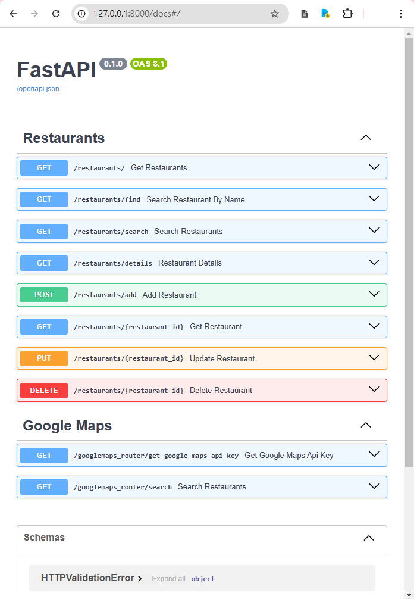
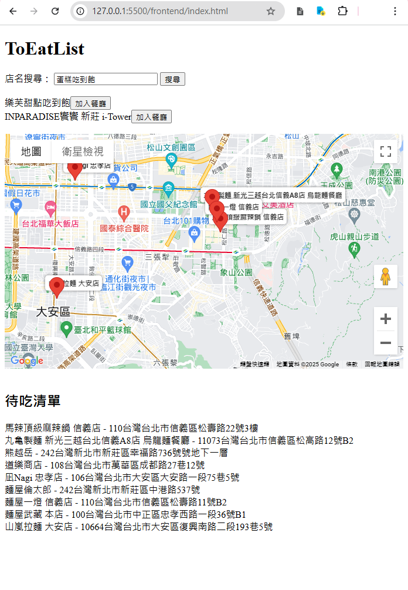

# to_eat_list

ToEat List
美食待吃清單

後端API: 
RestFul 該有的CRUD們


> 註: 使用了google的第三方服務google map，為求開發上的便利而拆分出來

簡易效果顯示(前端)



## API功能說明

### Restaurants 相關功能

- **GET /restaurants/**  
  取得所有餐廳資訊 

- **GET /restaurants/find**  
  根據餐廳名稱搜尋餐廳 

- **GET /restaurants/search**  
  搜尋餐廳（可以包含其他篩選條件） 

- **GET /restaurants/details**  
  取得餐廳詳細資訊 

- **POST /restaurants/add**  
  新增餐廳到清單 

- **GET /restaurants/{restaurant_id}**  
  根據餐廳 ID 取得單一餐廳資訊 

- **PUT /restaurants/{restaurant_id}**  
  更新餐廳資訊（例如名稱、是否已吃過） 

- **DELETE /restaurants/{restaurant_id}**  
  刪除指定的餐廳 

### Google Maps 相關功能

- **GET /googlemaps_router/get-google-maps-api-key**  
  取得 Google Maps API 金鑰 

- **GET /googlemaps_router/search**  
  使用 Google Maps 進行餐廳搜尋 


## Installation:

```bash
pip install -r requirements.txt
```

雖然requirements.txt列很多 但其實只是用了fastapi(和它的歡樂夥伴們) + googlemaps

- Optional:
    為求整潔而使用venv (非必要)
    舉例windows環境指令如下
    venv:
    ```cmd
    venv\Scripts\activate
    ```

run dev:
```cmd
fastapi dev main.py
```


#### 前端簡易展示

最輕鬆的方式是使用vscode的擴充元件LiveServer
在 frontend/index.html 右鍵open with liveserver
